# Semantic-Guided-Low-Light-Image-Enhancement
This is the official Pytorch implementation for our paper "**Semantic-Guided Zero-Shot Learning for Low-Light Image/Video Enhancement.**" 

# Updates
- 2021.10.8: An easy way to calculate mPA and mIOU score is available at this [repository](https://github.com/ShenZheng2000/DarkCityScape_mIOU_mPA)
- 2021.10.6: A sample enhanced low-light video in GIF format has been released. 
- 2021.10.5: A sample low-light video and its enhanced result is available at: [[Low-Light](https://www.youtube.com/watch?v=4Avy_xsczdU)]  [[Enhanced](https://www.youtube.com/watch?v=rN6Tf1E-kE8)]
- 2021.10.5: My new [repository](https://github.com/ShenZheng2000/Awesome-Low-Light-Enhancement-with-Deep-Learning) contains a collection of low-light enhancement methods. Hope you will find it helpful. 
- 2021.10.4: The arxiv link is available at http://arxiv.org/abs/2110.00970


# Abstract
Low-light images challenge both human perceptions and computer vision algorithms. It is crucial to make algorithms robust to enlighten low-light images for computational photography and computer vision applications such as real-time detection and segmentation tasks. This paper proposes a semantic-guided zero-shot low-light enhancement network which is trained in the absence of paired images, unpaired datasets, and segmentation annotation. Firstly, we design an efficient **enhancement factor extraction** network using depthwise separable convolution. Secondly, we propose a **recurrent image enhancement** network for progressively enhancing the low-light image. Finally, we introduce an **unsupervised semantic segmentation** network for preserving the semantic information. Extensive experiments on various benchmark datasets and a low-light video demonstrate that our model outperforms the previous state-of-the-art qualitatively and quantitatively. We further discuss the benefits of the proposed method for low-light detection and segmentation.

# Sample Results
## 1. Low-Light Video Frames
From left to right, and from top to bottom: Dark, Retinex [1], KinD [2], EnlightenGAN [3], Zero-DCE [4], Ours.

<p float="left">
<p align="middle">
  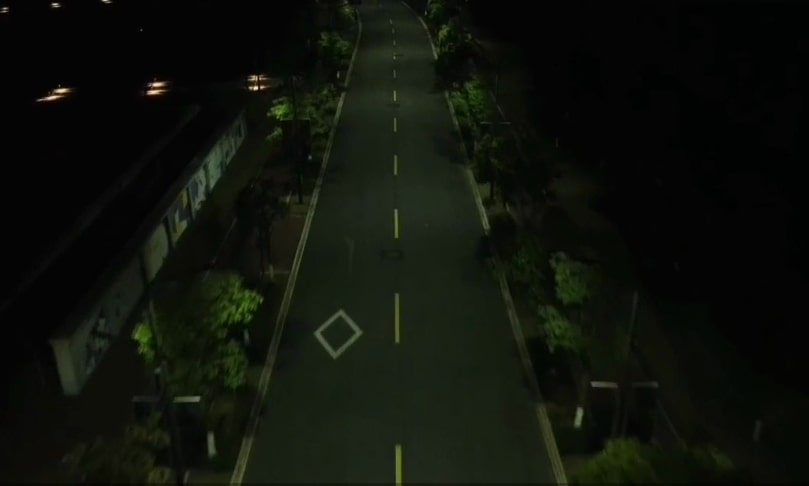
  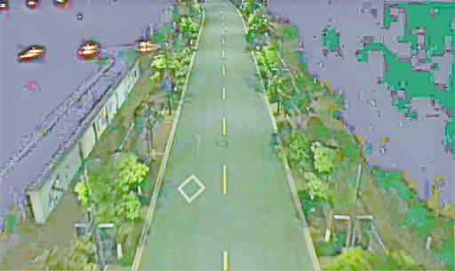 
  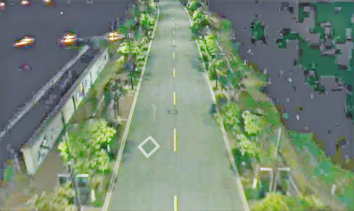
  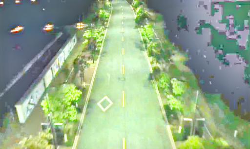
  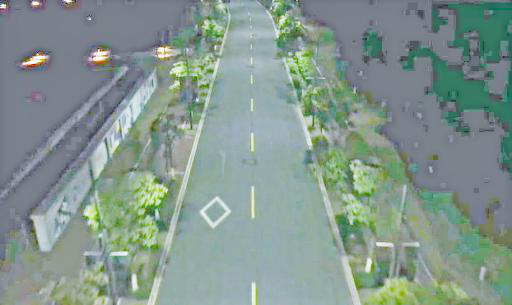 
  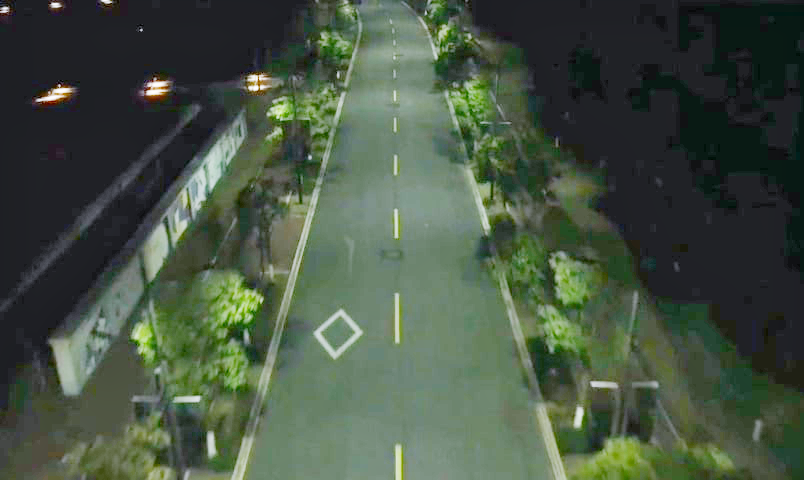
</p>

## 2. Low-Light Images (Real-World)
From left to right, and from top to bottom: Dark, PIE [5], LIME [6], Retinex [1], MBLLEN [7], KinD [2] , Zero-DCE [4], Ours

<p float="left">
<p align="middle">
  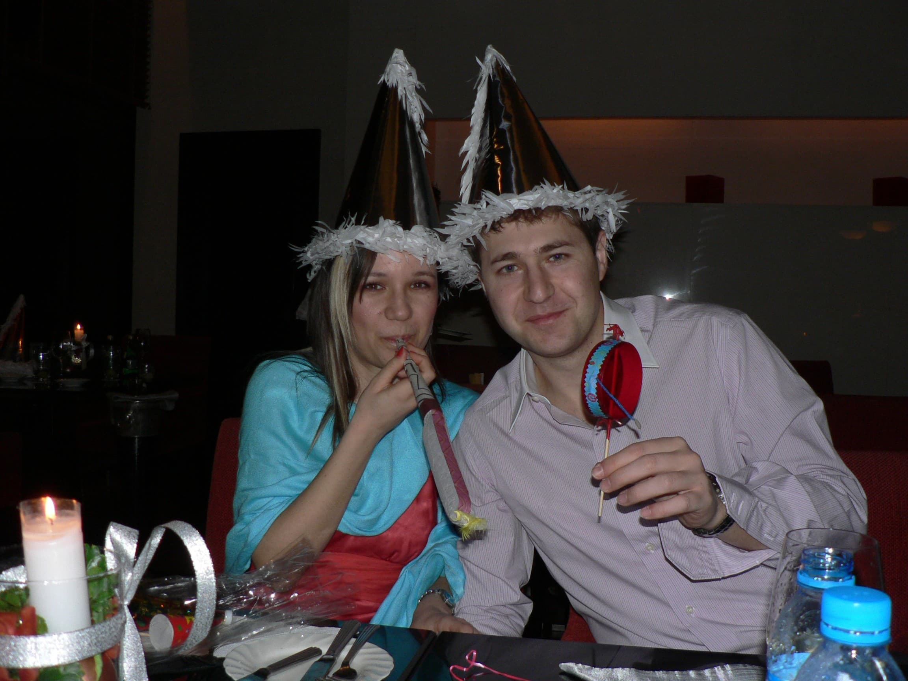
  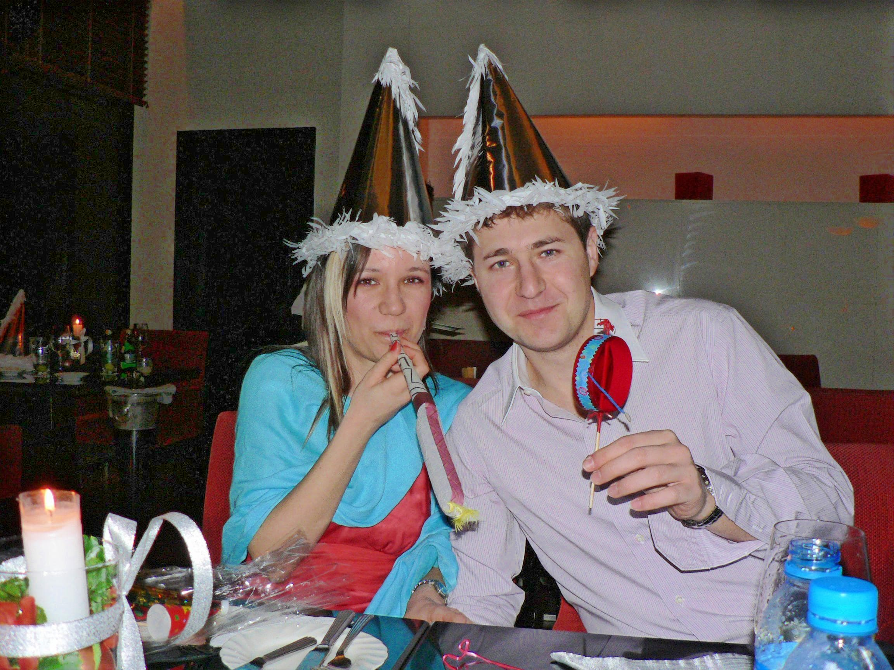 
  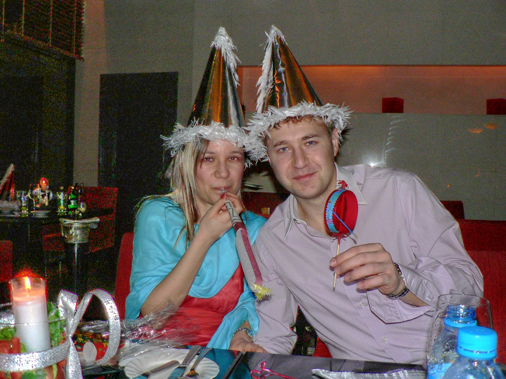
  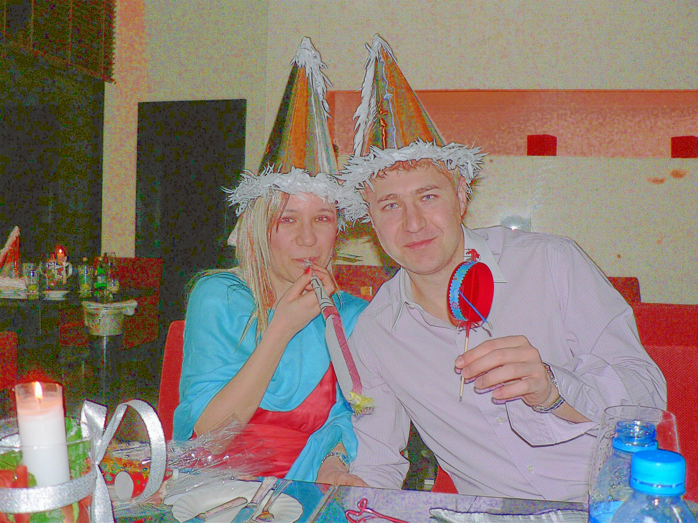
  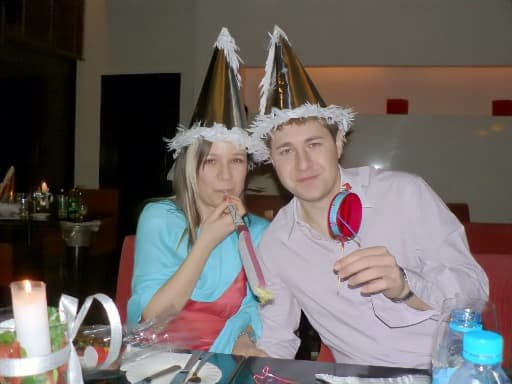 
  
  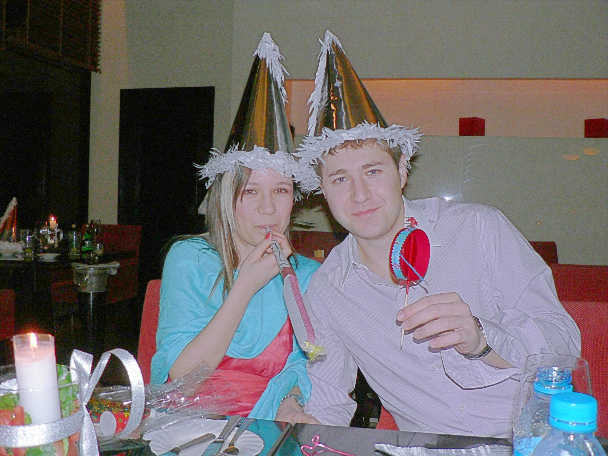 
  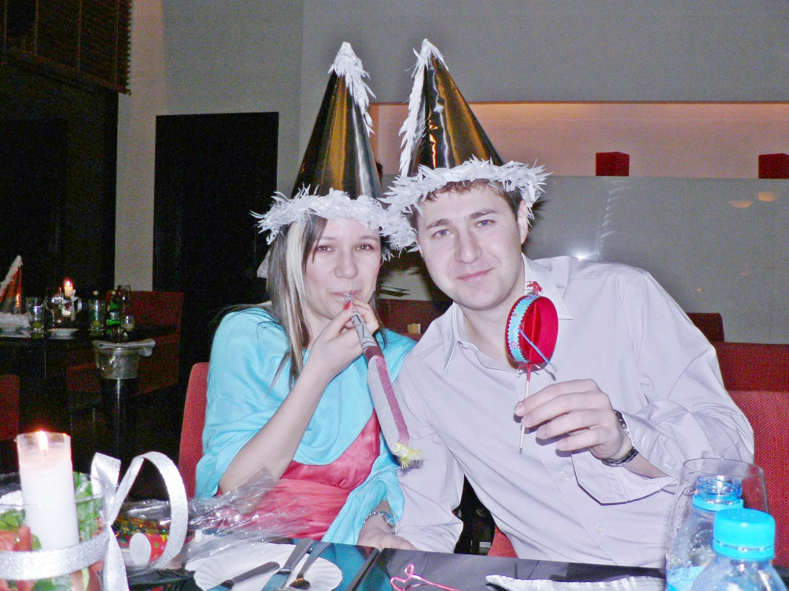
</p>

# Get Started

## 1. Requirements
* CUDA 10.0
* Python 3.6+
* Pytorch 1.0+
* torchvision 0.4+
* opencv-python
* numpy
* pillow
* scikit-image

## 2. Prepare Datasets
The official testing dataset can be downloaded from [BaiduYun](https://pan.baidu.com/s/1pbz0YlOmLqxnazeKrRRUQg) with password `8itq`. After download, move the unzipped file into `data/test_data/`. You can also put custom datasets or your own low-light images in this folder for testing. Example: `data/test_data/yourDataset/`

The official training dataset can be downloaded from [BaiduYun](https://pan.baidu.com/s/19ez3dM079WksPRB0Xw98kg) with password `n93t`. After download, move the unzipped file into `data/train_data/`. 

## 3. Training 
For model training, run in terminal:
```
python train.py --snapshots_folder weight_folder --pretrain_dir pretrained_weight_file
```

For example, if your folder to save weights are `weight`, and your most recent weight file are at`weight/Epoch99.pth`, run in terminal:
```
python train.py --snapshots_folder weight/ --pretrain_dir weight/Epoch99.pth
```
 
## 4. Testing
**NOTE**: Please delete all readme.txt in the `data` folder to avoid model inference error. 

For model testing, run in terminal 
```
python test.py --weight_dir pretrained_weight_file --test_dir output_folder 
```

For example, if your pretrained weight is at `weight/Epoch99.pth`, adn your path for saving testing output is `test_output`, you can run in terminal:
```
python test.py --weight_dir weight/Epoch99.pth --test_dir test_output
```

## 5. Testing on Videos
For model testing on videos (MP4 format), run in terminal:
```
bash test_video.sh
```

There are five hyperparameters in `demo/make_video.py`for video testing. See the following explanation. 
- `video_path`: path of the low-light video
- `image_lowlight_folder`: path of the low-light images
- `image_folder`: path of the enhanced images
- `save_path`: path of the enhanced video
- `choice`: whether converting video to image, or image to video


# Hyperparameters
| Name                 | Type  | Default            | 
|----------------------|-------|--------------------|
| lowlight_images_path | str   | data/train_data/   |         
| lr                   | float | 1e-3               |          
| weight_decay         | float | 1e-3               |            
| grad_clip_norm       | float | 0.1                |            
| num_epochs           | int   | 100                |          
| train_batch_size     | int   | 6                  |          
| val_batch_size       | int   | 8                  |           
| num_workers          | int   | 4                  |         
| display_iter         | int   | 10                 |         
| snapshot_iter        | int   | 10                 |        
| scale_factor         | int   | 1                  |         
| snapshots_folder     | str   | weight/            |         
| load_pretrain        | bool  | False              |       
| pretrain_dir         | str   | weight/Epoch99.pth |         
| num_of_SegClass      | int   | 21                 |        
| conv_type            | str   | dsc                |        
| patch_size           | int   | 4                  |        
| exp_level            | float | 0.6                |       


# TODO List
- [x] List (important) hyperparameters
- [x] Addres model input size issue
- [x] Upload Pretrained Weight 
- [x] Rewrite training and testing argparse in a option.py
- [x] Rewrite training as a class
- [x] Rewrite testing as a class  
- [x] Upload Testing Dataset
- [x] Upload Arxiv Link
- [x] Testing on Video
- [ ] Provide Online Demo
- [x] Upload BibTeX
- [ ] Modify Readme file

# Others
Please reach zhengsh@kean.edu if you have any questions. This repository is heavily based upon [Zero-DCE](https://github.com/Li-Chongyi/Zero-DCE). Thanks for sharing the code!

# Citations
Please cite the following paper if you find this repository helpful.
```
@article{zheng2021semantic,
  title={Semantic-Guided Zero-Shot Learning for Low-Light Image/Video Enhancement},
  author={Zheng, Shen and Gupta, Gaurav},
  journal={arXiv preprint arXiv:2110.00970},
  year={2021}
}
```


# References
[1] Wei, Chen, et al. "Deep retinex decomposition for low-light enhancement." arXiv preprint arXiv:1808.04560 (2018).

[2] Zhang, Yonghua, Jiawan Zhang, and Xiaojie Guo. "Kindling the darkness: A practical low-light image enhancer." Proceedings of the 27th ACM international conference on multimedia. 2019.

[3] Jiang, Yifan, et al. "Enlightengan: Deep light enhancement without paired supervision." IEEE Transactions on Image Processing 30 (2021): 2340-2349.

[4] Guo, Chunle, et al. "Zero-reference deep curve estimation for low-light image enhancement." Proceedings of the IEEE/CVF Conference on Computer Vision and Pattern Recognition. 2020.

[5] Fu, Xueyang, et al. "A probabilistic method for image enhancement with simultaneous illumination and reflectance estimation." IEEE Transactions on Image Processing 24.12 (2015): 4965-4977.

[6] Guo, Xiaojie, Yu Li, and Haibin Ling. "LIME: Low-light image enhancement via illumination map estimation." IEEE Transactions on image processing 26.2 (2016): 982-993.

[7] Lv, Feifan, et al. "MBLLEN: Low-Light Image/Video Enhancement Using CNNs." BMVC. 2018.

